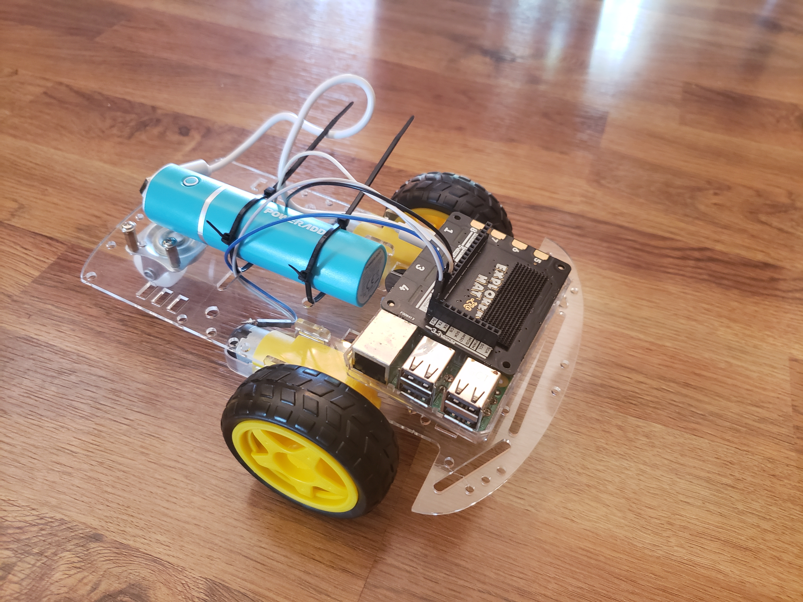

# Learning Robot



## Hardware Setup

### Materials
- Raspberry Pi
- Phone Charger Battery
- Explorerhat
- 2 wheel drive chassis kit

### Assembly

Assemble the chassis kit following the included
directions to match the image above. Attach
the explorerhat to the raspberry pi pin headers,
and wire the motors to the motor 1 and 2 ports
on the explorerhat. 

Use the phone charger battery to power up the raspberry pi.

## Software

Connect the raspberry pi to a network with internet using a standard
raspbian install. Install this code with

```commandline
cd Desktop
git clone https://github.com/RobertJN64/LearningRobotv2
cd LearningRobotv2
sudo python setup.py
```

Follow the prompts to setup the wifi network.
Once the installer finishes, reboot and connect
to the robot by connecting to the wifi network it
creates, and connecting to https://192.168.4.1


## Calibration

Hit the drive forward button, if the robot drives backwards or turns,
swap motor wires as necessary.
Hit the turn button, if the robot doesn't turn left, swap motor
wires as necessary.
Follow the rest of the calibration instructions on the webpage.

